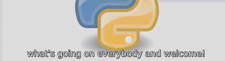

-------------------------------------------------------------
# Subtitles
Change the format of subtitles (.srt files)

Fernando Mendiburu - 2021
-------------------------------------------------------------

# Table of Contents

- [Installation](#installation)
- [Foundations](#Foundations)
- [User Guide](#User-Guide)


## Installation

Download from [here](https://github.com/fermendi/Subtitles/archive/main.zip) or using git clone:

```
$ git clone https://github.com/fermendi/Subtitles.git
```

## Foundations

The problem arises in some .srt files with time superposition. For example, let's see this subtitle:

<p align="center">
  
</p>

A pretty messy, this is because time superposition.

Using `subtitles.py`, the messy subtitle is fixed as below:

<p align="center">
  
</p>

## User Guide

The command structure has the following form:

```
$ subtitles.py --path_file PATH_FOLDER --overwrite_file OVERWRITE_FILE
```

--path_file: Accept a root path `PATH_FOLDER` in which .srt files are contained.

--overwrite_file: Choose if you would like to overwrite the file(s), `OVERWRITE_FILE` could be [Yes, No].

`subtitles.py` will fix each .srt file contained in `PATH_FOLDER` and subfolders.
